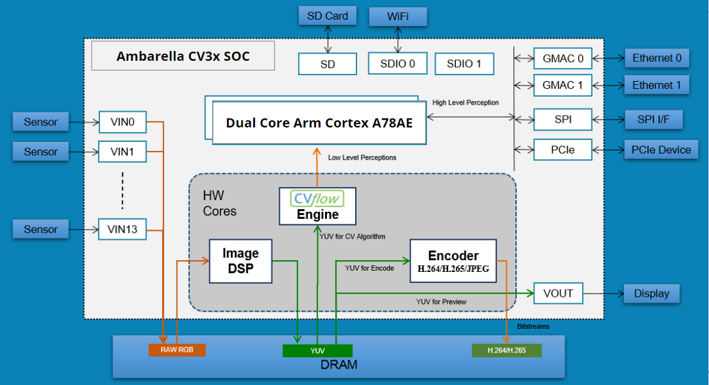
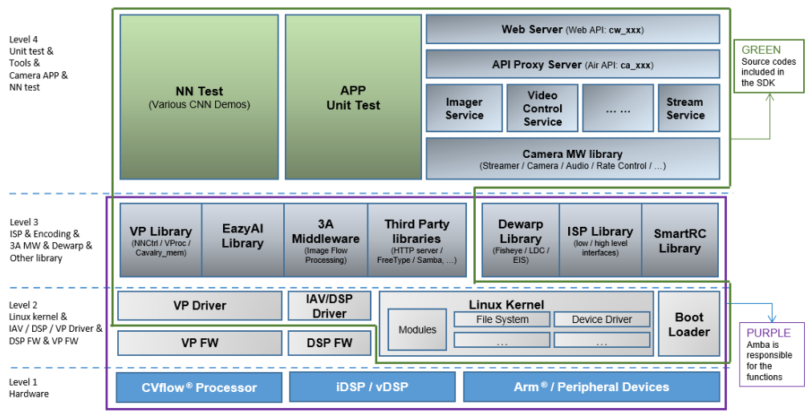
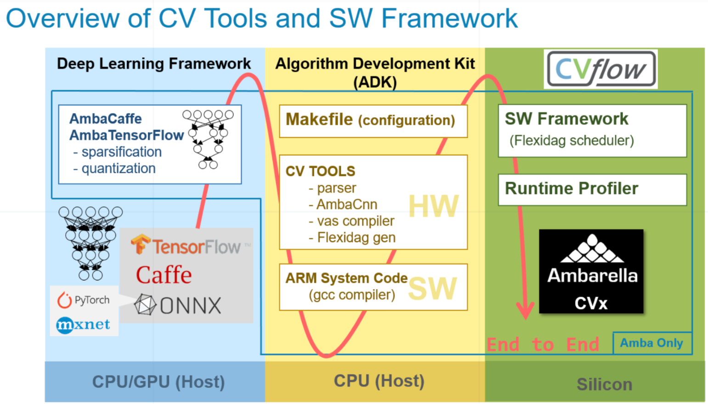
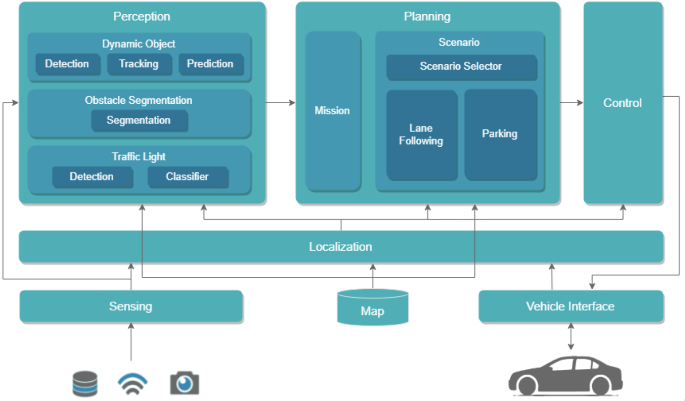

# CMU/OSHKOSH Autonomous Driving Software Performance Assessment Project

## Project Overview

This project is a collaboration between Carnegie Mellon University and Oshkosh Corporation. The primary objective is to explore the performance of the Autoware autonomous driving software stack on Ambarella edge devices and compare it with the NVIDIA platform. The project aims to benchmark the capabilities of the Ambarella devices to inform future evaluations for autonomous driving solutions.

## Project Objectives

1. **Implement Autoware on Ambarella Edge Device**: Deploy the Autoware stack on Ambarella hardware, particularly focusing on testing compatibility and performance.

2. **Evaluate Ambarella Device Capabilities**: Assess the hardware’s efficiency in running autonomous driving workloads, especially focusing on perception, planning, and control tasks.

3. **Benchmarking and Comparison**: Measure and compare the performance of the Ambarella device against a baseline NVIDIA device in terms of CPU/GPU usage, power consumption, frame rates, and overall processing efficiency.

## Hardware Overview



### Ambarella CV3x SOC
- **CPU**: Dual Core Arm Cortex A78AE
- **NVP (Neural Vector Processor)**: 6 Cores for high-performance, low-latency NN processing.
- **GVP (General Vector Processor)**: 2 Cores optimized for traditional computer vision and radar processing.
- **RAM**: 8GB

## Software Framework



### CV Flow/CNNGen

- A comprehensive framework for the deployment of neural networks on Ambarella hardware.
- Supports popular AI frameworks including Caffe, TensorFlow, and ONNX.

### Autoware

- Deployed on Ambarella via Docker to avoid dependency conflicts and ensure smooth operation.
- Focused on testing planning and control pipelines due to limited out-of-the-box support for hardware-accelerated perception.

## Testing and Benchmarking

### Benchmark Methodologies
- **Reaction Analyzer**: Evaluates the responsiveness of nodes in planning and control pipelines by analyzing timestamps of obstacle-based events.
- **System Logger**: Monitors CPU/GPU/NVP/GVP usage to determine the overall performance of the Ambarella device during various workloads.

### Key Findings
- **Performance**: The Ambarella device exhibited significant strengths in image processing and neural network inference, but struggled with CPU-intensive tasks like planning and control compared to the NVIDIA platform.
- **Boot Times**: Notable differences were observed, with Ambarella taking significantly longer to boot Autoware components compared to the NVIDIA baseline.

## Recommendations for Future Work

1. **Secondary Device Integration**: Propose using a secondary device for running Autoware while leveraging Ambarella for perception tasks, thus optimizing overall system performance.

2. **RViz Offloading**: Suggest offloading RViz rendering tasks to a secondary display device to reduce overhead on the Ambarella hardware.

3. **CVFlow Integration**: Future work should focus on integrating Ambarella’s CVFlow framework into the Autoware perception stack to replace CUDA-dependent models, potentially improving performance on Ambarella hardware.

## Acknowledgments

We would like to express our gratitude to:
- **Professor Bain and Professor Youssfi** for their invaluable guidance and support.
- **John, Sri, and Steven** for their assistance throughout the project.
- **Oshkosh Corporation** for providing the necessary hardware and workspace.
- **Carnegie Mellon University** for the NVIDIA computers that were crucial for the benchmarking.

## References

- [Autoware Documentation](https://autowarefoundation.github.io/autoware-documentation/main/)
- [Autoware GitHub Repository](https://github.com/autowarefoundation)
- [Cooper SDK Documentation](https://github.com/autowarefoundation)

---

# Appendix 1: How-to Guides

## Run Autoware through Docker
First, follow the instructions on [Autoware Documentation](https://autowarefoundation.github.io/autoware-documentation/main/) to install Autoware.

To launch the container, run
`rocker -e LIBGL_ALWAYS_SOFTWARE=1 --x11 --user --volume $HOME/autoware --volume $HOME/autoware_map --volume $HOME/autoware_data -- ghcr.io/autowarefoundation/autoware-universe:latest-cuda`

Get the ID of the running container by running
`docker ps -a`

In the second terminal, run
`docker exec -it [ID OF RUNNING CONTAINER] bash`

Once inside docker container, source your workspace
`source ~/autoware/install/setup.bash`

## Test a planning simulation
To make sure the autoware version and dependencies are working correctly, try an autonomous path planning simulation

`ros2 launch autoware_launch planning_simulator.launch.xml map _path:=$HOME/autoware_map/sample-map-planning vehicle_model:=sample_vehicle sensor_model:=sample_sensor_kit`

## Reaction Analyzer
Reaction Analyzer benchmarks response times between nodes by spawning a dummy obstacle in front of the ego vehicle.

To run reaction analyzer

`ros2 launch reaction_analyzer reaction_analyzer.launch.xml running_mode:=planning_control vehicle_model:=sample_vehicle sensor_model:=sample_sensor_kit map_path:=$HOME/autoware_map/nishishinjuku_autoware_map `

## Autoware System Monitoring
### Supported Monitors
- **CPU Monitor**
- **Memory Monitor**
- **GPU Monitor**

### How to Use
```
chmod +x system_logger.py
python3 log_system_monitor.sh
```

## Autoware Topics Monitoring
### Supported Topics
- **/diagnostic/planning_evaluator/metrics**
- **/diagnostics**
- **/diagnostics_agg**
- **/diagnostics_err**
- **/diagnostics_toplevel_state**

### Obtain topics list
`ros2 topic list > topic_list.txt`

### How to Use
```
source ~/autoware/install/setup.bash
source /opt/ros/humble/setup.bash
chmod +x diagnostics_logger.py
python3 diagnostics_logger.py
```

## Analysis
### Visualization
`pip install pandas matplotlib`

```
python3 Visualization\ambarella_cooper_home_visual.py
python3 Visualization\ambarella_system_usage_visual.py
python3 Visualization\nvidia_system_usage_visual.py
```
                                                                                                                                    
